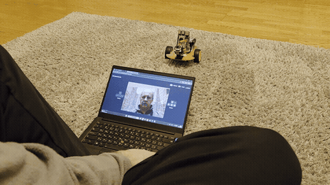

# KPI Arduino Lab 7 - Robot Eye v2

This project is a remote-controlled robot system with face tracking capabilities, built on Raspberry Pi (Backend) and Raspberry Pi Pico (Firmware).

## 🌍 Project Resources

- **Project Website (Frontend)**: [alexsik76.github.io/kpi-arduino-lab7](https://alexsik76.github.io/kpi-arduino-lab7/)
- **Repository**: [GitHub](https://github.com/Alexsik76/kpi-arduino-lab7)

## 📂 System Architecture

### 1. Frontend (`/docs`)

- **Type**: Web Interface (HTML/CSS/JS) hosted on GitHub Pages.
- **Documentation**: [Read more](docs/README.md)

### 2. Firmware (`/app/firmware`)

- **Type**: MicroPython for Raspberry Pi Pico.
- **Role**: Motor and servo control.
- **Documentation**: [Read more](app/firmware/README.md)

### 3. Backend (Root Directory)

- **Type**: Python (FastAPI).
- **Role**: Computer vision, face tracking, and hardware orchestration.

---

## 🔧 Backend Documentation

The backend runs on the robot's onboard computer (Raspberry Pi).

### Server Addresses

These addresses are only accessible when the robot is **powered on** and connected to the network.

- **Global Address**: `https://robot.lab.vn.ua` (Public Internet)
- **Local Address**: `https://robo.lan` (Local Network - Low Latency)

### API Endpoints

- **Swagger Documentation**: `/docs` (e.g., `https://robo.lan/docs`)

| Method | Endpoint         | Description                               |
| :----- | :--------------- | :---------------------------------------- |
| `GET`  | `/health`        | System status check.                      |
| `GET`  | `/video_feed`    | MJPEG video stream with tracking overlay. |
| `POST` | `/control/mode`  | Toggle Manual/Auto Mode.                  |
| `POST` | `/control/move`  | Drive motors.                             |
| `POST` | `/control/servo` | Move camera head.                         |

### Setup & Running

1. **Install Dependencies**:
   ```bash
   pip install -r requirements.txt
   ```
2. **Start Server**:
   ```bash
   python main.py
   ```

## Demo



The browser console shows the camera stream from the robot.
WASD keys drive the platform, the arrow pad moves the camera,
and face detection runs on the device itself.
